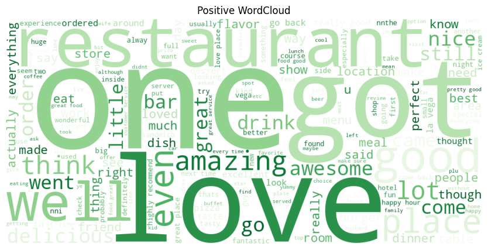
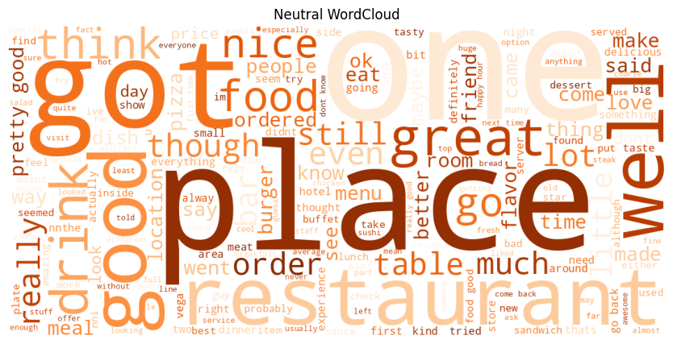
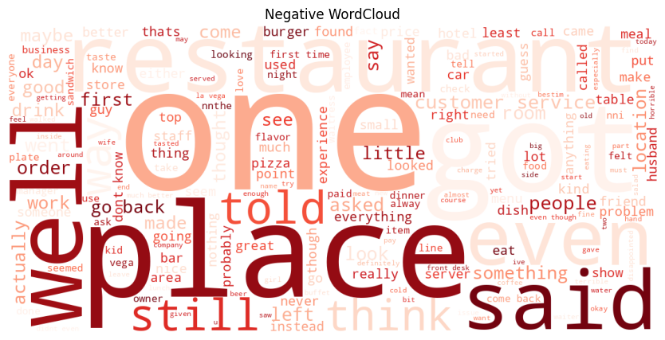
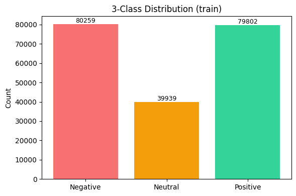

# Sentiment Analysis on Yelp Reviews

This project predicts the sentiment of a restaurant review as Positive, Neutral, or Negative. It includes a Flask web app, a training notebook and an exported model used for fast usage.

The web app lets you paste a review and see a small bar chart with the three class probabilities.

---

# Dataset

This project uses Yelp reviews and maps star ratings into three classes for the web app: Negative for 1–2 stars, Neutral for 3 stars, and Positive for 4–5 stars. This three-way split keeps the model and UI consistent with how people typically read ratings, with 3 stars treated as a genuinely middle sentiment.

For reference, the commonly used Yelp reviews polarity dataset and constructed by Xiang Zhang (xiang.zhang@nyu.edu) and available via `https://course.fast.ai/datasets` is binary, grouping 1–2 stars as negative and 3–4 stars as positive, with 280,000 training and 19,000 test samples per class (560,000** train, 38,000** test total). The original Yelp dataset can be downloaded from `https://www.yelp.com/dataset/download`; it is large (~7M lines), so for quick experiments a smaller sample such as 50,000 rows is often used.

## Word Clouds

To get a quick feel for the language used in each sentiment, I generated **word clouds** from the most frequent tokens in the training data. Positive reviews tend to highlight food quality and service; neutral reviews often include mixed or factual statements; negative reviews emphasize issues or dissatisfaction. These visuals help guide feature choices and error analysis.

**Positive**  

**Neutral**  

**Negative**  

---

## Review Distribution

We also checked how many examples fall into each class. A balanced or near-balanced split helps models learn each class reliably; if one class is smaller, you may consider class weights or resampling when training.

---

## Training and evaluation

- Training is done in the provided **SentimentAnalysisYelpFinalCode.ipynb**.  
- The notebook performs cleaning, vectorization, model training, and evaluation.  
- The final model is exported to `model/sentiment_analysis_model.joblib` for the Flask app. 
